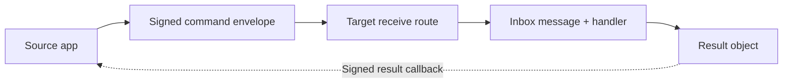

# Laravel Talkto

Laravel Talkto is a generic Laravel package for secure service-to-service command delivery. It gives Laravel applications a common transport layer for signed envelopes, outbox/inbox persistence, handler execution, retries, attempts, dead letters, idempotency, replay protection, source action lifecycle hooks, and signed result callbacks.

The package intentionally stops at the communication boundary. Host applications keep their own domain rules, model lookups, validation, writes, dashboards, rollout decisions, and callback side effects.

## What Laravel Talkto Is

Laravel Talkto helps one Laravel app send a command to another Laravel app, persist the lifecycle on both sides, run an approved receiver handler, and record enough state for retries and operations.

It is useful when service communication needs to be signed, replay-aware, idempotent, observable, and recoverable without copying the same transport code into every application.



## When To Use It

- You have two or more Laravel services exchanging commands.
- You need HMAC signing, timestamp checks, and payload hashes.
- You want outbox/inbox records for message lifecycle and operator review.
- You need idempotency and duplicate message protection.
- You want retry, dead-letter, and report commands around message state.
- You want package-owned transport behavior while host code owns business behavior.

## When Not To Use It

- You only need an in-process service class call.
- You need a general event bus, stream processor, or pub/sub platform.
- You need the package to own host-specific business dashboards or operational policy.
- You want the package to own host domain logic, permissions, or data mapping.
- You want the package to decide what callback results mean for host business side effects.

## Core Features

- Signed command envelopes with HMAC SHA-256.
- Payload hashing and timestamp tolerance checks.
- v2 signatures by default with required nonce replay protection.
- Outbox/inbox persistence on `talkto_messages`.
- Attempt and lifecycle event tracking.
- Incoming command handler contracts and registry.
- Outgoing target config, aliases, and registry.
- Source action lifecycle wrapping for outgoing flows.
- Idempotency and replay protection using the message ledger.
- Retry/backoff state and retry command.
- Dead Letter Queue storage and reprocess command.
- Read-only metrics, health summaries, report command, and message trace command.
- Optional Talkto Panel for local message inspection, trace, safe retry/reprocess actions, and connection health.
- Read-only security audit command and centralized redaction.
- Signed result callback sender and receiver runtime, with contracts that hosts can override.

## Optional Talkto Panel

Laravel Talkto includes an optional Blade/Tailwind operations panel. It is disabled by default and can show local message history, detail/trace views, safe retry and dead-letter reprocess actions, passive connection health, and optional active health checks for configured health URLs.

```dotenv
TALKTO_PANEL_ENABLED=true
TALKTO_PANEL_PREFIX=admin/talkto
TALKTO_PANEL_AUTHORIZATION_ENABLED=true
TALKTO_PANEL_GATE=viewTalktoPanel
```

The panel does not require Livewire, Vue, React, Inertia, Filament, or required frontend JavaScript. See [docs/panel.md](docs/panel.md) for setup, security defaults, view publishing, payload visibility, and production guidance.

## 60-Second Architecture Overview

1. The source app creates a durable outgoing `TalktoMessage`.
2. The package builds and signs an envelope for the configured target service.
3. The target app verifies the signature, timestamp, target service, command allowlist, and payload hash.
4. The target app stores an incoming message and queues handler processing.
5. The configured handler returns a `TalktoIncomingCommandResult`.
6. The package updates message status, attempts, events, retry state, and DLQ state.
7. The destination can send a signed result callback to the source through `ResultCallbackSenderContract`.

Routes and migrations are disabled by default. Hosts opt in only after confirming route ownership and table ownership.

## Requirements

- PHP `^8.2`
- Laravel components compatible with `^12.0|^13.0`
- A queue worker for asynchronous send and receive jobs
- A database connection for package message tables when package migrations are enabled
- Shared secrets configured per service pair

## Installation

```bash
composer require mrezdev/laravel-talkto
php artisan vendor:publish --tag=laravel-talkto-config
php artisan vendor:publish --tag=laravel-talkto-migrations
```

Short publish tags are also available:

```bash
php artisan vendor:publish --tag=talkto-config
php artisan vendor:publish --tag=talkto-migrations
```

Review the published config before enabling package routes or migrations.

## 5-Minute Quickstart

Install and publish:

```bash
composer require mrezdev/laravel-talkto
php artisan vendor:publish --tag=talkto-config
php artisan vendor:publish --tag=talkto-migrations
```

Set the local service name:

```dotenv
TALKTO_SERVICE=source-service
TALKTO_ROUTES_ENABLED=false
TALKTO_MIGRATIONS_ENABLED=false
```

Configure one outgoing target:

```php
'outgoing' => [
    'target-service' => [
        'url' => env('TALKTO_TARGET_SERVICE_URL', 'https://target.example.test'),
        'endpoint' => '/api/talkto/receive',
        'secret' => env('TALKTO_TO_TARGET_SERVICE_SECRET'),
        'mode' => 'reliable',
    ],
],
```

Configure one incoming command handler on the receiving app:

```php
'incoming' => [
    'source-service' => [
        'secret' => env('TALKTO_FROM_SOURCE_SERVICE_SECRET'),
        // Missing or empty allowed_commands rejects all commands.
        'allowed_commands' => [
            'domain.command' => [
                'driver' => 'handler',
                'handler' => App\Talkto\Handlers\DomainCommandHandler::class,
                'idempotency' => 'required',
            ],
        ],
    ],
],
```

Incoming command allowlists are fail-closed: a command is accepted only when it is explicitly listed under the source service. Use `allow_all_commands => true` only for trusted/internal development cases.

Create a small generic handler:

```php
<?php

namespace App\Talkto\Handlers;

use Mrezdev\LaravelTalkto\Contracts\TalktoIncomingCommandHandler;
use Mrezdev\LaravelTalkto\Models\TalktoMessage;
use Mrezdev\LaravelTalkto\Services\TalktoIncomingCommandResult;

final class DomainCommandHandler implements TalktoIncomingCommandHandler
{
    public function handle(TalktoMessage $message): TalktoIncomingCommandResult
    {
        $payload = $message->payload ?? [];

        if (! isset($payload['resource_id'])) {
            return TalktoIncomingCommandResult::failedFinal('Missing resource_id.');
        }

        return TalktoIncomingCommandResult::succeeded([
            'processed' => true,
            'resource_id' => $payload['resource_id'],
        ]);
    }
}
```

Send a generic command:

```php
use Mrezdev\LaravelTalkto\Services\TalktoOutgoingMessageFactory;

$message = app(TalktoOutgoingMessageFactory::class)->create(
    target: 'target-service',
    command: 'domain.command',
    payload: ['resource_id' => 'resource-123'],
    options: [
        'business_key' => 'business-key-123',
        'idempotency_key' => 'source-service:domain.command:business-key-123:v1',
    ],
);
```

Run workers and operational commands:

```bash
php artisan queue:work
php artisan talkto:retry-failed --dry-run
php artisan talkto:report --hours=24 --direction=all --limit=20
php artisan talkto:trace <message-id>
php artisan talkto:audit-security
php artisan talkto:security-audit
```

## Artisan Scaffolding Generators

Laravel Talkto can generate host-app scaffolding for outgoing and incoming command flows. The generated files live under a direction-first structure, while the host app still owns payload mapping, validation, business writes, config review, and rollout.

```bash
php artisan talkto:make-outgoing inventory verify-invoice
php artisan talkto:make-outgoing inventory verify-invoice --transactional
php artisan talkto:make-incoming inventory website.invoice-verified
php artisan talkto:make-integration inventory verify-invoice --outgoing
php artisan talkto:make-integration inventory verify-invoice --outgoing --transactional
php artisan talkto:make-integration inventory website.invoice-verified --incoming
```

```text
app/Talkto/
  Outgoing/{Service}/
    {Service}TalktoClient.php
    {Service}OutgoingCommand.php
    Commands/{Command}/
      Send{Command}To{Service}.php
      {Command}PayloadBuilder.php
      Prepare{Command}SourceAction.php
  Incoming/{Service}/
    {Service}IncomingCommand.php
    Commands/{Command}/
      {Command}Handler.php
      Handle{Command}From{Service}.php
      {Command}PayloadValidator.php
```

`Prepare{Command}SourceAction.php` is generated only for `--transactional`. Incoming generators print a config snippet for manual `config/talkto.php` review; they do not edit config automatically.

Read more in [docs/scaffolding.md](docs/scaffolding.md) and [docs/transactional-outgoing.md](docs/transactional-outgoing.md).

Hosts that need custom proxy, TLS, tracing, circuit breaker, or test transport behavior can override the outgoing HTTP client through `TalktoHttpClient`. See [docs/http-client.md](docs/http-client.md).

## Security Model Summary

Laravel Talkto signs canonical message fields using HMAC SHA-256. Incoming requests can be verified for signature, timestamp tolerance, target service, known source service, command allowlist, payload hash, and replay protection.

By default, outgoing messages use v2 signatures, incoming verification accepts v2 only, and v2 requests require a nonce. v1 remains available only as an explicit legacy/manual opt-in for rare interoperability, debugging, or migration cases. Use `talkto:audit-security` for PASS/WARN/FAIL deployment checks, or `talkto:security-audit` for the detailed finding report. Never commit real shared secrets.

Read more in [docs/security.md](docs/security.md) and [docs/production-hardening.md](docs/production-hardening.md).

## Retry, DLQ, And Observability Summary

Retry state is stored on message records and processed through `talkto:retry-failed`. Retry policy starts with global defaults and can be overridden by direction, peer/target, and command. Final or exhausted failures can be stored in `talkto_dead_letters` when DLQ support is enabled and migrated. `talkto:dlq-reprocess` lets operators reprocess eligible dead letters deliberately.

Observability is read-only: `TalktoMetricsCollector`, `TalktoHealthChecker`, `talkto:report`, and `talkto:trace` summarize existing message state without dispatching jobs or mutating rows. Use `talkto:trace <message-id>` or `talkto:trace --correlation=<correlation-id>` to inspect one flow across related messages, attempts, events, dead letters, and callbacks with payload redacted by default. Operators can use `talkto:recover-stale --dry-run` before recovering messages stuck in stale in-flight locks, and `talkto:prune --dry-run` before deleting old retention data including expired nonce ledger rows.

Read more in [docs/recovery-monitoring-template.md](docs/recovery-monitoring-template.md), [docs/production-readiness.md](docs/production-readiness.md), and [docs/troubleshooting.md](docs/troubleshooting.md).

## Result Callback Runtime

The package provides a generic signed callback runtime through `ResultCallbackSenderContract` and `ResultCallbackReceiverContract`. Host apps may still override either contract and still decide what callback outcomes mean for their own side effects.

Source apps must configure the destination service under `talkto.incoming` and allow the callback command, which defaults to `talkto.result`. Destination apps must configure the source service under `talkto.outgoing` with a callback endpoint and shared secret.

The package receive route depends on `talkto.routes.enabled`; the callback route depends on both `talkto.routes.enabled` and `talkto.callbacks.enabled`. Routes and migrations are disabled by default and remain disabled if their config keys are missing, so hosts must explicitly opt in to package route or migration loading.

```php
use Mrezdev\LaravelTalkto\Contracts\ResultCallbackSenderContract;
use Mrezdev\LaravelTalkto\Services\TalktoIncomingCommandResult;

$result = TalktoIncomingCommandResult::succeeded(['processed' => true]);

app(ResultCallbackSenderContract::class)->sendResult($message, $result);
```

Read more in [docs/result-callbacks.md](docs/result-callbacks.md) and [docs/callback-contract-template.md](docs/callback-contract-template.md).

## Documentation Map

Start with the documentation index: [docs/README.md](docs/README.md).

Common next stops:

- [docs/installation.md](docs/installation.md)
- [docs/configuration.md](docs/configuration.md)
- [docs/extending.md](docs/extending.md)
- [docs/sending-commands.md](docs/sending-commands.md)
- [docs/http-client.md](docs/http-client.md)
- [docs/panel.md](docs/panel.md)
- [docs/handling-commands.md](docs/handling-commands.md)
- [docs/scaffolding.md](docs/scaffolding.md)
- [docs/transactional-outgoing.md](docs/transactional-outgoing.md)
- [docs/new-service-onboarding.md](docs/new-service-onboarding.md)
- [docs/local-http-e2e-template.md](docs/local-http-e2e-template.md)
- [docs/command-contract-template.md](docs/command-contract-template.md)
- [docs/callback-contract-template.md](docs/callback-contract-template.md)
- [docs/recovery-monitoring-template.md](docs/recovery-monitoring-template.md)
- [docs/production-hardening.md](docs/production-hardening.md)
- [docs/production-rollout-template.md](docs/production-rollout-template.md)
- [docs/release-readiness.md](docs/release-readiness.md)
- [docs/PUBLIC_API.md](docs/PUBLIC_API.md)
- [UPGRADE.md](UPGRADE.md)

Repository and release preparation:

- [docs/private-repository-setup.md](docs/private-repository-setup.md)
- [docs/ci.md](docs/ci.md)
- [docs/release-process.md](docs/release-process.md)
- [docs/release-readiness.md](docs/release-readiness.md)
- [docs/versioning.md](docs/versioning.md)
- [docs/private-composer-installation.md](docs/private-composer-installation.md)
- [docs/first-private-repository-commit.md](docs/first-private-repository-commit.md)
- [docs/first-private-release-tag.md](docs/first-private-release-tag.md)
- [docs/package-extraction-checklist.md](docs/package-extraction-checklist.md)
- [docs/public-release-readiness.md](docs/public-release-readiness.md)

## Public API / Extension Points

Host applications should depend on documented contracts and services rather than internal pipeline details:

- `TalktoIncomingCommandHandler`
- `TalktoIncomingHandlerRegistryContract`
- `TalktoOutgoingTargetRegistryContract`
- `TalktoHttpClient`
- `IncomingCommandResultContract`
- `ResultCallbackSenderContract`
- `ResultCallbackReceiverContract`
- `SourceActionContract`
- `TalktoOutgoingMessageFactory`
- `TalktoFlowFactory`
- `TalktoMetricsCollector`
- `TalktoHealthChecker`
- `TalktoTraceReporter`
- `TalktoSecurityAuditor`
- `talkto:retry-failed`
- `talkto:dlq-reprocess`
- `talkto:prune`
- `talkto:recover-stale`
- `talkto:report`
- `talkto:trace`
- `talkto:audit-security`
- `talkto:security-audit`

The detailed public surface is tracked in [docs/PUBLIC_API.md](docs/PUBLIC_API.md).

## Current Maturity / Release Status

This package is licensed under MIT and is ready for public Composer/Packagist distribution after the normal release checklist passes.

Treat tags as package version boundaries, and review [UPGRADE.md](UPGRADE.md), [CHANGELOG.md](CHANGELOG.md), and [docs/public-release-readiness.md](docs/public-release-readiness.md) before broad distribution.

## License

Laravel Talkto is open-sourced software licensed under the MIT license.

## Testing

For a package-local checkout:

```bash
composer install
vendor/bin/pest
```

Fresh host integrations should run at least one outgoing message test, one incoming message test, one duplicate `message_id` test, one retry dry run, and one report command in a non-production environment.

## Host App Responsibilities

Host applications own command naming, payload mapping, validation, model lookup, writes, callback side effects, dashboards, traffic enablement, and operational runbooks.
