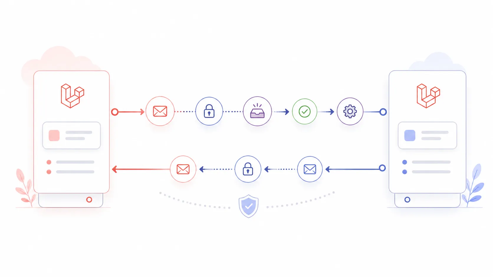
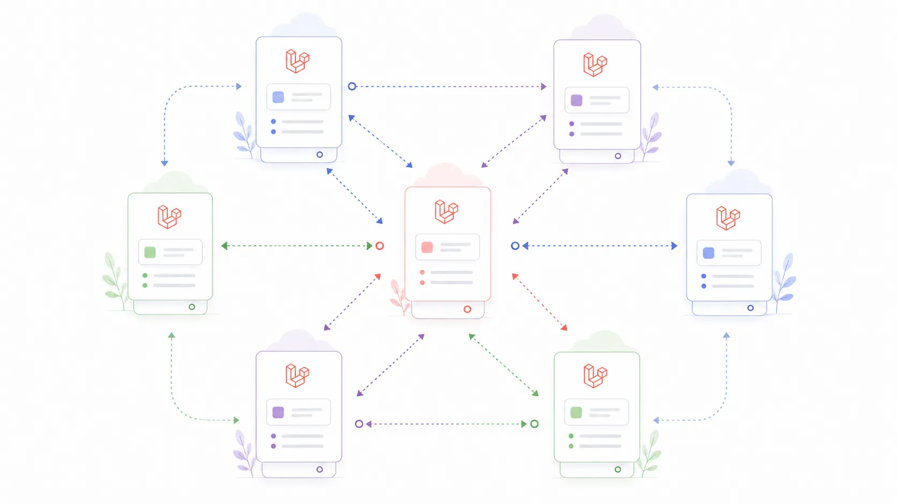

# Laravel Talkto Documentation

Laravel Talkto helps Laravel applications communicate through reliable, signed, durable service-to-service messages. It gives each app a shared communication boundary for sending, receiving, retrying, and observing work without making either side depend on the other's internal model.

Talkto owns the communication boundary: envelopes, signatures, durable message records, retries, dead letters, result callbacks, and operational visibility. Host applications own the business rules, payload meaning, validation, permissions, model lookup, and data mapping.

The goal is reliable communication between Laravel applications without tightly coupling their internal logic. Each service can keep its own domain decisions while Talkto keeps the message path explicit, durable, and observable.

    

## Two Laravel apps, one clear conversation

One Laravel app can send a command or message to another Laravel app without tightly coupling their internal business logic. The sending app describes what it needs, the receiving app decides how to handle it, and Talkto keeps the communication layer consistent between them.

That pattern works for many everyday service conversations: orders, inventory, billing, notifications, internal tools, and background workflows. The apps do not need to share controllers, models, database tables, or private implementation details just to communicate reliably.

## A complete message lifecycle

A Talkto message is not just a basic HTTP request. It has a full lifecycle that is stored, signed, verified, processed, and reported in a way that can survive retries and operational review.

Conceptually, a message can move through these steps:

- Create an outgoing message.
- Sign the envelope.
- Send it securely.
- Receive it in the target Laravel app.
- Verify the signature, timestamp, payload hash, and replay protection.
- Store the incoming record.
- Process the configured handler.
- Persist the result.
- Retry or fail safely when something goes wrong.
- Optionally send a durable callback with the processing result.

    

## A distributed Laravel ecosystem

As more Laravel apps join the system, Talkto helps keep communication organized through clear commands, signed envelopes, retries, dead letters, result callbacks, and observability. Each app can stay focused on its own business behavior while the package handles the shared transport concerns.

This can help projects move toward a more modular, microservice-friendly architecture without forcing a full event-streaming platform. Talkto is meant for teams that want durable service-to-service communication, explicit operational state, and Laravel-native integration.

    

## Technical Documentation

Use the sections below to move from setup into the deeper package behavior, examples, operations, package development, and upgrade support.

### Start Here

- [Installation](installation.md) - install from Packagist, publish real package assets, run migrations, and perform first checks.
- [Configuration](configuration.md) - configure service names, routes, storage, peers, security, queues, callbacks, retry, DLQ, panel, and retention.
- [Security](security.md) - understand v2 signatures, nonce replay protection, safe defaults, and dangerous manual settings.
- [Production hardening](production-hardening.md) - checklist for a real Laravel host app before exposing Talkto traffic.
- [Troubleshooting](troubleshooting.md) - symptoms, likely causes, and safe fixes.

### Core Concepts

- [Architecture](architecture.md) - outgoing, incoming, callback, retry, and DLQ flows.
- [Sending commands](sending-commands.md) - source-side command creation.
- [Handling commands](handling-commands.md) - receiver-side handlers and results.
- [Result callbacks](result-callbacks.md) - signed callback runtime.
- [Extending Laravel Talkto](extending.md) - supported extension points.
- [Public API](PUBLIC_API.md) - supported public surface, extension points, and the internal boundary between stable host-facing contracts and package internals.

### Examples

- [Outgoing-only example](examples/outgoing-only.md)
- [Incoming-only example](examples/incoming-only.md)
- [Bidirectional callback example](examples/bidirectional-callback.md)
- [Command contract template](command-contract-template.md)
- [Callback contract template](callback-contract-template.md)
- [Host integration template](host-integration-template.md)

### Operations

- [Recovery and monitoring](recovery-monitoring-template.md)
- [Talkto Panel](panel.md)
- [Testing](testing.md)
- [Smoke tests](smoke-tests.md)
- [Production rollout template](production-rollout-template.md)
- [Release readiness](release-readiness.md)
- [Release process](release-process.md)
- [CI](ci.md)
- [Versioning](versioning.md)

### Package Development

- [Scaffolding generators](scaffolding.md)
- [Transactional outgoing](transactional-outgoing.md)
- [HTTP client extension](http-client.md)
- [Local HTTP end-to-end template](local-http-e2e-template.md)
- [Installing into existing apps](installing-into-existing-apps.md)
- [New service onboarding](new-service-onboarding.md)

### Upgrade And Support

- [Package upgrading notes](upgrading.md)
- [Root upgrade guide](../UPGRADE.md)
- [Root changelog](../CHANGELOG.md)
- [Security policy](../SECURITY.md)
- [Support policy](../SUPPORT.md)

## Maintainer Notes

Internal maintainer notes are kept in the repository only and are not part of the published package archive.
