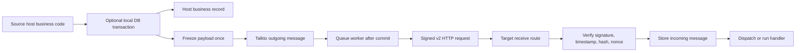
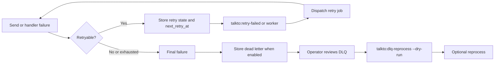

# Architecture

Laravel Talkto is an outbox/inbox transport package. Host apps own their business transactions and handlers; the package owns signed envelopes, message storage, retries, callbacks, and operational visibility.

## Outgoing Command Flow

The source transaction may create a host business record and the Talkto outbox row together. Remote delivery happens after commit through the worker/retry flow; do not treat local message creation as synchronous remote success.

The outgoing payload freeze happens once before the outbox row is written. The stored primitive payload is reused for hashing, signing, sending, retry, DLQ, callbacks, and repair.

## Incoming Command Flow

```mermaid
flowchart LR
    A["Signed command envelope"] --> B["Receive controller or host wrapper"]
    B --> C["Verify source and target"]
    C --> D["Verify timestamp, payload hash, signature"]
    D --> E["Consume v2 nonce"]
    E --> F["Check message_id idempotency"]
    F --> G["Check command allowlist"]
    G --> H["Store inbox message"]
    H --> I["Dispatch ProcessIncoming job"]
    I --> J["Host handler returns result"]
```

Verification is fail-closed. Unknown sources, target mismatches, invalid signatures, missing v2 nonces, reused nonces, and disallowed commands are rejected before handler execution.

## Result Callback Flow

```mermaid
flowchart LR
    A["Target handler result"] --> B["ResultCallbackSenderContract"]
    B --> C["Freeze callback payload once"]
    C --> D["Store durable callback message"]
    D --> E["Queue SendTalktoMessage"]
    E --> F["Sign callback with v2 nonce"]
    F --> G["Source callback route"]
    G --> H["Verify callback signature and nonce"]
    H --> I["Find original outgoing message"]
    I --> J["Validate callback relationship"]
    J --> K["Update destination result/status"]
    K --> L["Record callback events"]
```

Callbacks are ordinary signed Talkto messages with the callback command, which defaults to `talkto.result`. Callback data captures one frozen primitive payload snapshot, so repeated direct `toPayload()` or `toEnvelope()` calls reuse the same payload and hash. The source app must configure the destination as an incoming source and allow the callback command.

## Retry And DLQ Flow

Retry policy can be configured globally and overridden by direction, peer, and command. DLQ reprocessing is an operator action and should be reviewed before dispatching.
